# DesignPatterns

|  名称   |  类图   |  应用场景   |
| ---- | ---- | ---- |
| 单例模式 |  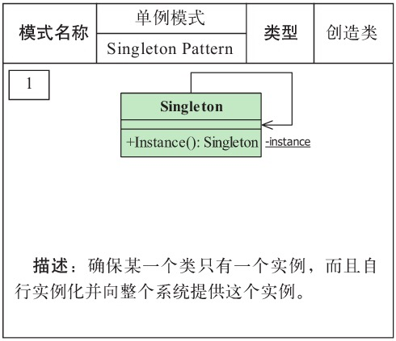     |   |
| 工厂方法模式 |  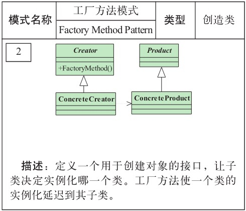     |     |
| 抽象工厂模式 |  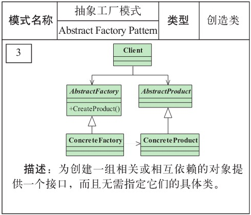     |     |
| 建造者模式 |  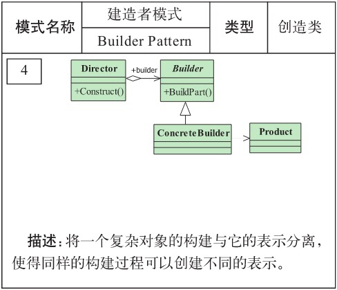     |     |
| 原型模式 |  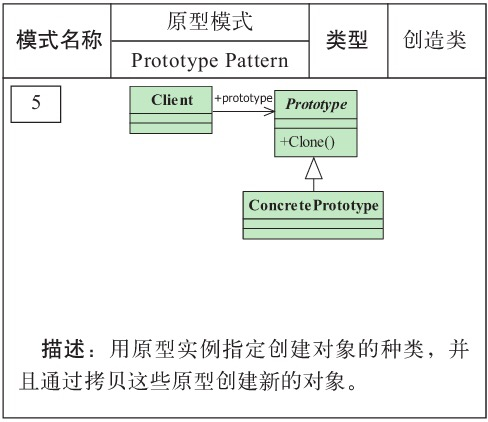     |     |
| 迭代器模式 |  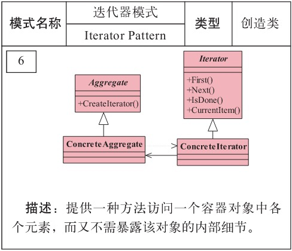     |     |
| 命令模式 |  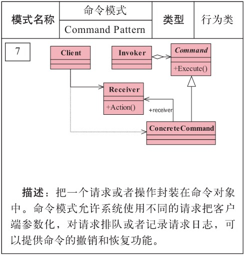     |     |
| 解释器模式 |  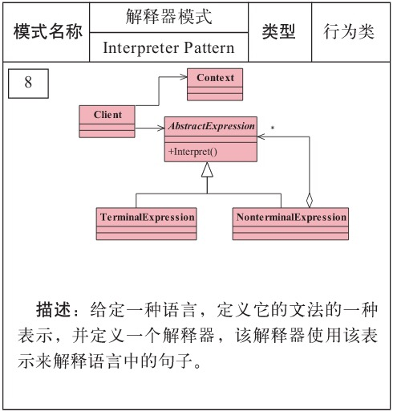     |     |
| 责任链模式 |  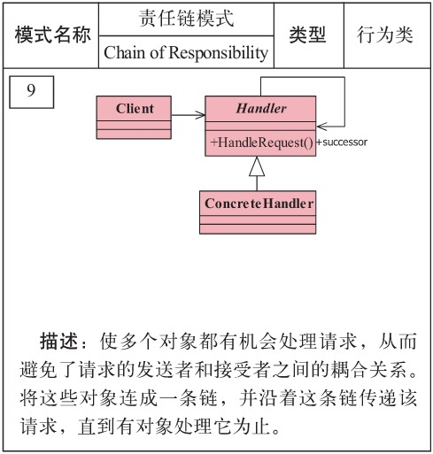     |     |
| 观察者模式 |  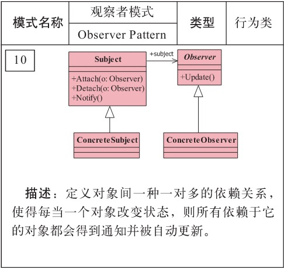     |     |
| 中介者模式 |  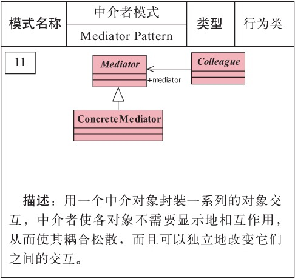     |     |
| 备忘录模式 |  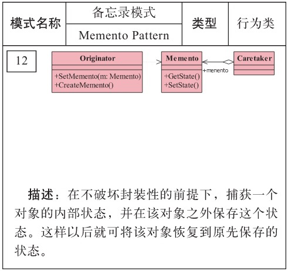     |     |
| 状态模式 |  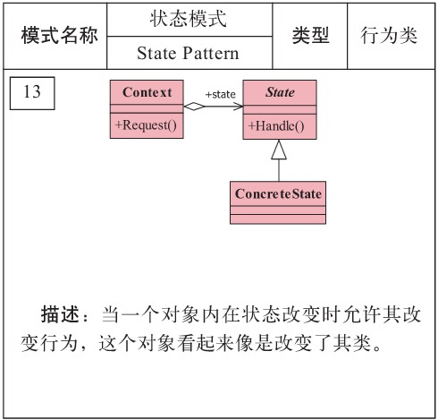     |     |
| 策略模式 |  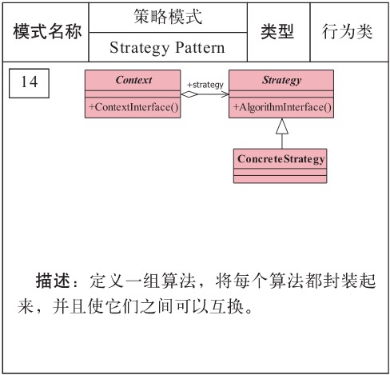     |     |
| 模板方法模式 |  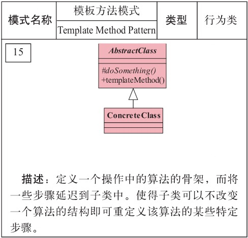     |     |
| 访问者模式 |  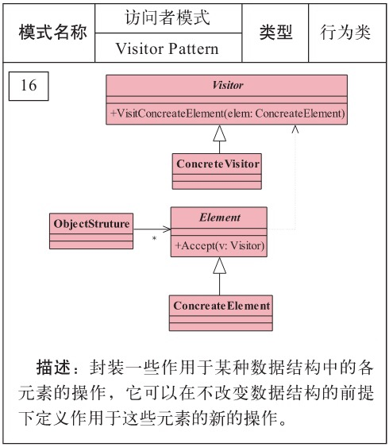     |     |
| 适配器模式 |  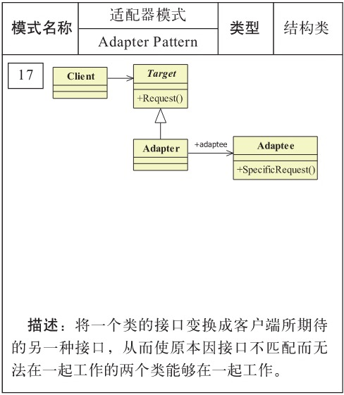     |     |
| 组合模式 |  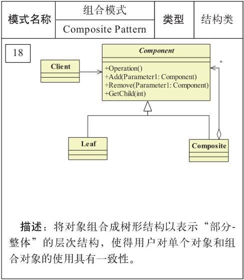     |     |
| 代理模式 |  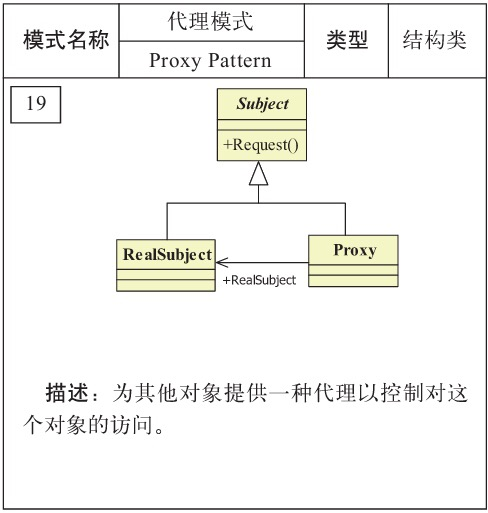     |     |
| 桥接模式 |  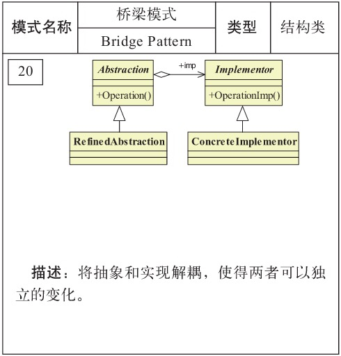     |     |
| 装饰模式 |  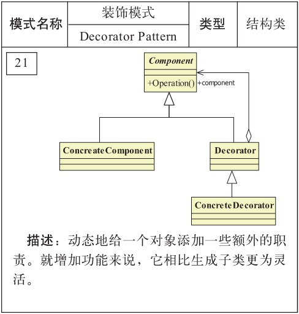     |     |
| 门面模式 |  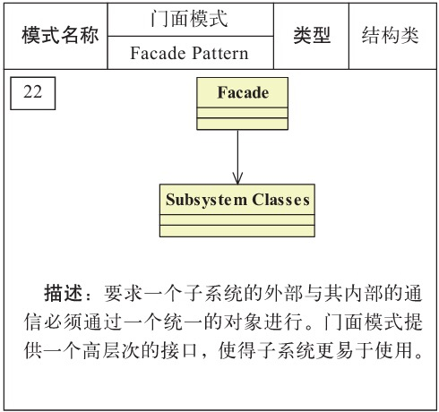     |     |
| 享元模式 |  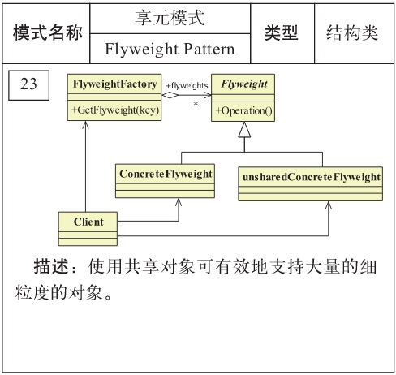     |     |
